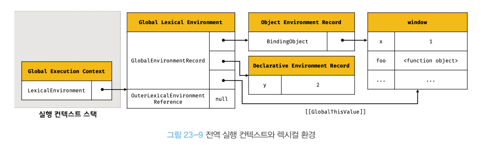

# 23. 실행 컨텍스트

## 핵심 내용

- 실행 컨텍스트는 다음과 관련이 있다.
  - 자바스크립트가 스코프를 기반으로 식별자와 식별자에 바인딩된 값(식별자 바인딩)을 관리하는 방식
  - 호이스팅이 발생하는 이유
  - 클로저의 동작 방식
  - 태스크 큐와 함께 동작하는 이벤트 핸들러
  - 비동기 처리의 동작 방식
- 소스코드의 타입에 따라 실행 컨텍스트를 생성하는 과정과 관리 내용이 다르다.
  - 전역 코드
  - 함수 코드
  - eval 코드
  - 모듈 코드

## 소스코드의 평가와 실행

- 자바스크립트 엔진은 소스코드를 2개의 과정 `평가` 와 `실행` 으로 나누어 처리한다.

### 평가

- 실행 컨텍스트 생성
- 변수, 함수 등의 선언문만 먼저 실행
- 생성된 변수나 함수 식별자를 키로 실행 컨텍스트가 관리하는 스코프(렉시컬 환경의 환경 레코드)에 등록

### 실행

- 런타임 시작
- 변수나 함수의 참조는 실행 컨텍스트가 관리하는 스코프에서 검색해 취득
- 변수 값의 변경 등 실행 결과는 실행 컨텍스트가 관리하는 스코프에 등록

## 실행 컨텍스트란?

<aside>
💡 식별자를 등록하고 관리하는 `스코프` 와 `코드 실행 순서 관리` 를 구현한 내부 메커니즘

</aside>

### 실행 컨텍스트의 역할!

1. 식별자(변수, 함수, 클래스 등의 이름)와 이에 바인딩 된 값을 관리
   1. `렉시컬 환경` 으로 관리
2. 코드의 실행 순서를 관리
   1. `실행 컨텍스트 스택` 으로 관리
   2. 소스코드가 평가되면 실행 컨텍스트가 생성되고 실행 컨텍스트 스택의 최상위에 쌓인다.

## 렉시컬 환경

- 식별자와 식별자에 바인딩된 값, 그리고 상위 스코프에 대한 참조를 기록하는 자료구조
- 실행 컨텍스트를 구성하는 컴포넌트
- 렉시컬 스코프의 실체
- `환경레코드` 와 `외부 렉시컬 환경에 대한 참조` 로 이루어짐

### 환경 레코드

- 스코프에 포함된 식별자를 등록하고 바인딩된 값을 관리하는 저장소

### 외부 렉시컬 환경에 대한 참조

- 상위 스코프
  - 외부 렉시컬 환경, 즉 해당 실행 컨텍스트를 생성한 소스코드를 포함하는 상위 코드의 렉시컬 환경
- 이를 통해 단방향 링크드 리스트인 `스코프 체인` 구현
  

## 질문

- 자바스크립트에서 호이스팅이 발생하는 이유를 실행 컨텍스트와 연관지어 설명해주세요.
