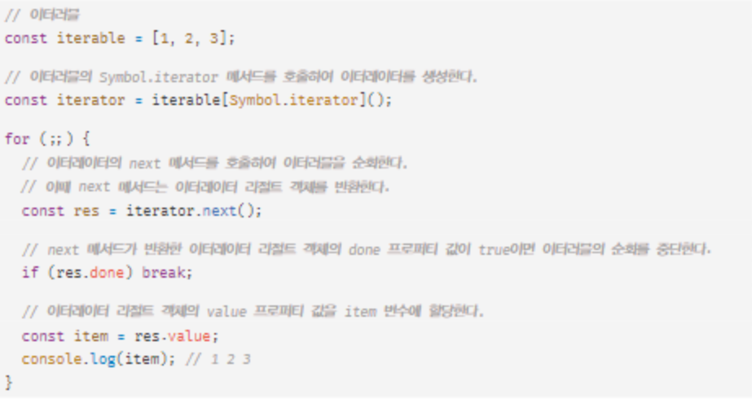

# 34. 이터러블

## 이터레이션 프로토콜

<aside>
💡 이터레이션 프로토콜은 이터러블 프로토콜과 이터레이터 프로토콜로 구성된다.

</aside>

## 이터러블

<aside>
💡 이터러블 프로토콜을 준수한 객체

</aside>

- 즉 Symbol.iterator를 프로퍼티 키로 사용한 메서드를 직접 구현하거나 프로토타입 체인을 통해 상속받은 객체
- `for...of` , 스프레드 문법, 배열 디스트럭처링 할당의 대상으로 사용할 수 있다.

## 이터레이터

<aside>
💡 이터러블의 Symbol.iterator 메서드가 반환한 이터레이터는 next 메서드를 갖는다.

</aside>

## 유사 배열 객체

<aside>
💡 length 프로퍼티를 가지며, 인덱스로 프로퍼티 값에 접근할 수 있는 객체

</aside>

- 기본적으로 Symbol.iterator 메서드가 없기 때문에 이터러블이 아니다.
- 단 `arguments`, `NodeList`, `HTMLCollection`은 유사 배열 객체이면서 이터러블이다.

## 이터레이션 프로토콜의 필요성

<aside>
💡 다양한 데이터 공급자가 하나의 순회 방식을 갖도록 규정하여 데이터 소비자가 효율적으로 공급자를 사용할 수 있도록 인터페이스의 역할을 한다.

</aside>

- 데이터 공급자
  - 이터러블
- 데이터 소비자
  - `for...of` , 스프레드 문법, 배열 디스트럭처링 할당
- ES6 이전의 순회 가능한 데이터 컬렉션(배열, 문자열, 유사 배열 객체, DOM 컬렉션 등)은 동일한 규약 없이 각자 나름의 구조대로 for문, for…in문, forEach 메서드 등 다양한 방법으로 순회할 수 있었다.
- ES6에서는 순회 가능한 데이터 컬렉션을 이터레이션 프로토콜을 준수하는 이터러블로 통일하여 for…of문, 스프레드 문법, 배열 디스트럭처링 할당의 대상으로 사용할 수 있도록 일원화했다.

## 사용자 정의 이터러블

- 이터레이터의 next 메서드는 `pre` `cur` `max` 를 참조하는 클로저라고 볼 수 있을 듯 하다.
- 아래의 반복문을 보며 생각해보자.

