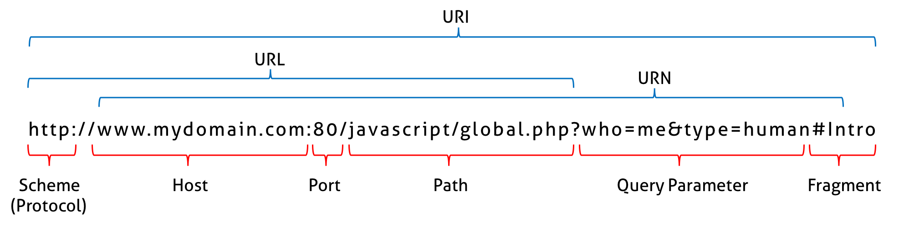

# 38. 브라우저의 렌더링 과정

## 핵심 내용

1. 렌더링이란 HTML, CSS, 자바스크립트로 작성된 문서를 파싱하여 브라우저에 시각적으로 출력하는 것을 말한다.
   1. HTML, CSS 파싱은 브라우저의 렌더링 엔진이, 자바스크립트 파싱은 브라우저의 자바스크립트 엔진이 담당한다.
2. 리플로우는 레이아웃 계산을 다시 하는 것을 말한다.
3. 리페인트는 재결합된 렌더 트리를 기반으로 다시 페인트하는 것을 말한다.

## 기본적인 렌더링 과정

1. 브라우저는 HTML, CSS, JS, 이미지, 폰트 파일 등 렌더링에 필요한 리소스를 요청하고 서버로부터 응답을 받는다.
2. 브라우저의 렌더링 엔진은 서버로부터 응답된 HTML과 CSS를 파싱하여 DOM과 CSSOM을 생성하고 이들을 결합해 렌더 트리를 생성한다.
3. 브라우저의 자바스크립트 엔진은 서버로부터 응답된 자바스크립트를 파싱하여 AST를 생성하고 바이트코드로 변환하여 실행한다. 이때 자바스크립트는 DOM API를 통해 DOM이나 CSSOM을 변경할 수 있다. 변경된 DOM과 CSSOM은 다시 렌더 트리로 결합된다.
4. 렌더 트리를 기반으로 HTML 요소의 레이아웃을 계산하고 브라우저 화면에 HTML 요소를 페인팅한다.

## HTML 파싱과 DOM 생성

1. 브라우저 주소창에 URL을 입력하고 엔터를 누르면 URL의 호스트 이름이 DNS를 통해 IP 주소로 변환되고 이 IP 주소를 갖는 서버에게 요청을 전송한다.

1. 서버는 브라우저가 요청한 HTML 파일을 읽어 들여 메모리에 저장한 다음 메모리에 저장된 바이트(2진수)를 인터넷을 경유해 응답한다.
2. 바이트 형태로 응답받은 HTML 문서는 meta 태그의 charset 어트리뷰트에 의해 지정된 인코딩 방식(utf-8 등)을 기준으로 문자열로 변환된다. 참고로 인코딩 방식은 서버 응답의 헤더에 포함되어 브라우저는 이를 확인해 문자열로 변환하는 것이다.
3. 서버로부터 응답 받은 HTML문서는 문자열이기 때문에 브라우저가 이해할 수 있는 트리 자료구조인 DOM으로 변환하여 메모리에 저장한다. (토큰 분해 - 노드 객체 생성 - 트리 생성)

## CSS 파싱과 CSSOM 생성

1. HTML을 순차적으로 파싱하여 DOM을 생성하는 과정에서 CSS를 로드하는 link 태그나 style 태그를 만나면 DOM 생성을 일시 중단한다.
2. link 태그의 href 어트리뷰트에 지정된 CSS 파일을 서버에 요청하여 로드한 CSS 파일이나 style 태그 내의 CSS를 HTML과 동일한 파싱 과정(바이트→문자→토큰→노드→CSSOM)을 거쳐 CSSOM을 생성한다.
3. 이후 DOM 생성을 재개한다.

## 렌더 트리 생성

- DOM과 CSSOM을 결합해 렌더링을 위한 트리 구조인 `렌더 트리` 를 생성한다.
- 렌더 트리는 HTML 요소들의 레이아웃(위치와 크기)을 계산하는 데 사용되며 브라우저 화면에 픽셀을 렌더링하는 `페인팅` 처리에 입력된다.

## 자바스크립트 파싱과 실행

1. HTML을 순차적으로 파싱하여 DOM을 생성하는 과정에서 script 태그를 만나면 DOM 생성을 일시 중단한다.
2. 자바스크립트 파싱을 위해 자바스크립트 엔진에 제어권을 넘긴다.
3. 자바스크립트 엔진은 CPU가 이해할 수 있는 저수준 언어로 변환하고 실행하는 역할을 한다.
4. 렌더링 엔진이 HTML과 CSS를 파싱하여 DOM과 CSSOM을 생성하듯 자바스크립트 엔진은 자바스크립트를 해석하여 AST(추상적 구문 트리)를 생성한다.
5. AST를 기반으로 인터프리터가 실행할 수 있는 중간 코드(intermediate code)인 바이트코드를 생성하여 실행한다.

## 참고

- 리플로우
  - 노드 추가/삭제, 요소의 크기/위치 변경, 윈도우 리사이징 등 레이아웃에 영향을 주는 변경이 발생한 경우에 한해 실행된다.
  - 따라서 레이아웃에 영향이 없는 변경은 리플로우 없이 리페인트만 실행된다.
- 리페인트
  - 재결합된 렌더 트리를 기반으로 다시 페인트하는 것을 말한다.
  - 자바스크립트에 의한 노드 추가 또는 삭제
  - 브라우저 창의 리사이징에 의한 뷰포트 크기 변경
  - HTML 요소의 레이아웃(위치, 크기)에 변경을 발생시키는 width/height, margin, padding, border, display, position, top, right, bottom, left 등의 스타일 변경

## 질문

### 스크립트 태그의 위치

브라우저는 `동기적` 으로, 즉 위에서 아래 방향으로 순차적으로 HTML, CSS, 자바스크립트를 파싱하고 실행한다. 따라서 script 태그의 위치에 따라 HTML 파싱이 블로킹되어 DOM 생성이 지연될 수 있다. 이는 `페이지 로딩 시간 지연`, DOM 생성 완료 이전 `DOM API 사용 시 오류 발생`의 문제를 발생시킬 수 있다.

자바스크립트 파싱에 의한 DOM 생성 중단 문제를 근본적으로 해결하기 위해 script 태그에 async와 defer 어트리뷰트가 추가되었다. 이를 사용하면 자바스크립트 파일의 **로드(파싱과 실행은 동기적)**가 비동기적으로 동시에 실행된다. 다만 자바스크립트 실행 시점에 차이가 있다.

`async` 의 경우 자바스크립트의 파싱과 실행은 자바스크립트 파일 로드 직후에 실행되며, 이때 HTML 파싱이 중단된다. 만약 여러 개의 script 태그에 async를 적용하면 태그의 순서와 상관없이 로드가 완료된 자바스크립트부터 먼저 실행되므로 실행 순서가 보장되지 않는다.

`defer` 의 경우 DOM 생성이 완료된 이후(DOMContentLoaded 이벤트) 진행된다.
