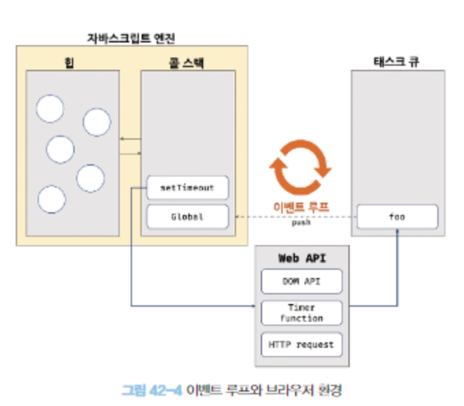

# 42. 비동기 프로그래밍

## 싱글 스레드

<aside>
💡 단 하나의 실행 컨텍스트 스택을 갖는다.

</aside>

- 한 번에 하나의 태스크만 실행할 수 있기 때문에 처리에 시간이 걸리는 태스크를 실행하는 경우 **블로킹**이 발생한다.
- 단, 타이머 함수인 `setTimeout` 과 `setInterval` , `HTTP 요청` , `이벤트 핸들러` 는 **비동기 처리 방식**으로 동작한다.

## 자바스크립트의 동시성

<aside>
💡 자바스크립트는 싱글스레드임에도 불구하고 `이벤트 루프`를 통해 동시성을 지원한다.

</aside>

### 자바스크립트 엔진

<aside>
💡 태스크가 요청되면 콜 스택을 통해 요청된 작업을 **순차적**으로 실행

</aside>

1. 콜 스택
   1. `실행 컨텍스트 스택`
2. 힙
   1. 객체가 저장되는 메모리 공간
   2. 콜 스택의 요소인 실행 컨텍스트가 힙의 객체를 참조하게 된다.
   3. 구조화되어있지 않다.
      1. 객체는 원시값과 달리 크기가 정해져있지 않으므로 할당해야 할 메모리 공간의 크기를 런타임에 동적으로 결정하기 때문이다.

### 브라우저(or Node.js)

<aside>
💡 비동기 처리에서 소스코드의 평가와 실행을 제외한 모든 처리가 이루어짐

</aside>

- 예를 들어, setTimeout의 콜백 함수의 평가와 실행은 자바스크립트 엔진이 담당하지만 호출 스케줄링을 위한 타이머 설정과 콜백 함수의 등록은 브라우저 or Node.js가 담당한다.

1. 태스크 큐
   1. 비동기 함수의 콜백 함수 또는 이벤트 핸들러가 일시적으로 보관되는 영역
2. 이벤트 루프
   1. 콜 스택에 현재 실행 중인 실행 컨텍스트가 있는지 확인
   2. 태스크 큐에 대기 중인 함수(콜백 함수, 이벤트 핸들러 등)가 있는지 반복해서 확인
   3. 만약 **콜 스택이 비어**있고, **태스크 큐에 대기 중인 함수가 있다**면 이벤트 루프는 순차적으로 태스크 큐에 대기 중인 함수를 콜 스택으로 이동시킴

## 싱글스레드? 멀티스레드?

- 자바스크립트는 싱글 스레드 방식으로 동작한다.
  - 이때 싱글 스레드 방식으로 동작하는 것은 브라우저가 아니라 **브라우저에 내장된 자바스크립트 엔진**이다.
- 즉 브라우저는 멀티 스레드로 동작한다.
  - 브라우저의 수행 동작과 자바스크립트 엔진의 수행 동작은 병행 처리된다.

## 브라우저

<aside>
💡 브라우저는 자바스크립트 엔진, 렌더링 엔진, Web API를 제공한다.

</aside>

- Web API는 ECMAScript 사양에 정의된 함수가 아니라 브라우저에서 제공하는 API
  - DOM API
  - 타이머 함수
  - HTTP 요청(Ajax)

## 질문

- 힙의 특징과 자바스크립트 엔진에서 객체가 저장되는 공간이 힙인 이유에 대해 아는대로 설명해주세요.
- setTimeout으로 타이머 기능을 단순하게 구현할 시 오차가 생길 수 있습니다. 그 이유에 대해 아는대로 설명해주세요.
