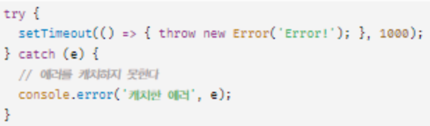

# 45. 프로미스

## 핵심 내용

- 프로미스는 전통적인 콜백 패턴이 가진 단점을 보완하며 비동기 처리 시점을 명확하게 표현할 수 있다.
  - 콜백 헬
  - 에러 처리의 한계

## 프로미스

### 프로미스의 상태 정보

<aside>
💡 프로미스의 상태는 resolve 또는 reject 함수를 호출하는 것으로 결정된다!

</aside>

| 프로미스의 상태 정보 | 상태 변경 조건                   |
| -------------------- | -------------------------------- |
| pending              | 프로미스가 생성된 직후 기본 상태 |
| fulfilled            | resolve 함수 호출                |
| rejected             | reject 함수 호출                 |

### 프로미스 체이닝

- 후속 처리 메서드 `then`, `catch`, `finally` 는 콜백 함수가 반환한 프로미스를 반환한다.
- 만약 후속 처리 메서드의 콜백 함수가 프로미스가 아닌 값을 반환하더라도 그 값을 암묵적으로 resolve 또는 reject하여 프로미스를 생성해 반환한다.

### 프로미스의 정적 메서드

1. Promise.resolve / Promise.reject
2. Promise.all

## 마이크로태스크 큐

<aside>
💡 마이크로 태스크 큐에는 **프로미스의 후속 처리 메서드의 콜백 함수**가 등록된다.

</aside>

- 그 외의 비동기 함수의 콜백 함수나 이벤트 핸들러는 태스크 큐에 일시 저장된다.
- 마이크로태스크 큐는 태스크 큐보다 우선순위가 **높다.**
- 이벤트 루프는 콜 스택이 비면 먼저 마이크로태스크 큐에서 대기하고 있는 함수를 가져와 실행하고, 마이크로태스크 큐가 비면 태스크 큐에서 대기하고 있는 함수를 가져와 실행한다.

## 참고 사항

<aside>
💡 **에러는 호출자 방향으로 전파된다**.

</aside>

- 즉, 콜 스택의 아래 방향으로 전파된다.
  - setTimeout 등의 함수의 콜백 함수를 호출한 것은 setTimeout 함수가 아닌 브라우저의 이벤트 루프이다.
  - 따라서 콜백 함수가 발생시킨 에러는 캐치하지 못한다.

## 질문

- 이벤트 핸들러는 비동기 처리의 대상입니다. 이벤트 핸들러가 비동기 방식으로 처리되는 원리를 설명해주세요.
- 아래 try catch 문에서 에러 처리의 곤란함과 그 이유를 설명해주세요.

